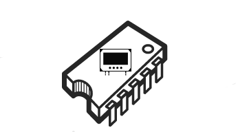
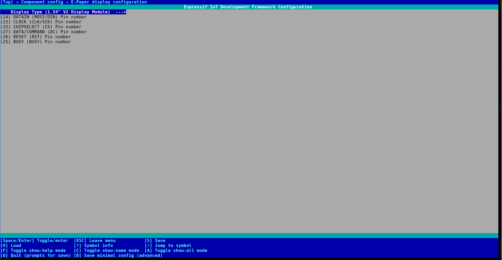
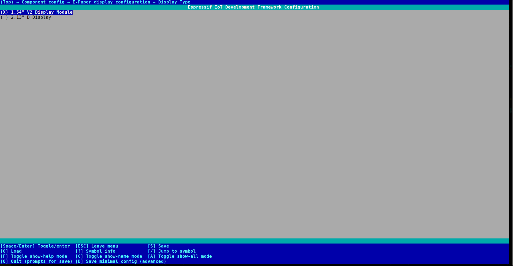

<br />
<p align="center">
  <a href="https://github.com/VedantParanjape/esp-epaper-display">
    
  </a>

  <p align="center">
    ESP-IDF component for Waveshare epaper displays
    <br/>
    <br/>
    <a href="https://github.com/VedantParanjape/esp-epaper-display/issues">Report Bug</a>
    ·
    <a href="https://github.com/VedantParanjape/esp-epaper-display/issues">Request Feature</a>
    ·
    <a href="https://github.com/VedantParanjape/esp-epaper-display/pulls">Send a Pull Request</a>
  </p>
</p>

<p align="center">


</p>

<p align="center">

</p>

# ESP32 Epaper Display component
ESP-IDF Component for driving waveshare's epaper displays. This is a port of Waveshare's official code for driving epaper display.     
* [ ] [1.02" D module](https://www.waveshare.com/wiki/1.02inch_e-paper_Module)    
* [x] [1.54" V2 module](https://www.waveshare.com/wiki/1.54inch_e-Paper_Module)   
* [ ] [1.54" B module](https://www.waveshare.com/wiki/1.54inch_e-Paper_Module_(B))    
* [ ] [1.54" C module](https://www.waveshare.com/wiki/1.54inch_e-Paper_Module_(C))    
* [ ] [2.13" V2 module](https://www.waveshare.com/wiki/2.13inch_e-Paper_HAT)    
* [ ] [2.13" B module](https://www.waveshare.com/wiki/2.13inch_e-Paper_HAT_(B))   
* [ ] [2.13" C module](https://www.waveshare.com/wiki/2.13inch_e-Paper_HAT_(C))   
* [x] [2.13" D module](https://www.waveshare.com/wiki/2.13inch_e-Paper_HAT_(D))   
* [ ] [2.66" module](https://www.waveshare.com/wiki/2.66inch_e-Paper_Module)    
* [x] [2.7" module](https://www.waveshare.com/wiki/2.7inch_e-Paper_HAT)   
* [ ] [2.7" B module](https://www.waveshare.com/wiki/2.7inch_e-Paper_HAT_(B))   


## Installation

```
cd <your_esp_idf_project>
mkdir components
cd components
git clone https://github.com/VedantParanjape/esp-epaper-display.git epaper
```

Change CMakeList.txt to add the line given below:

`set(EXTRA_COMPONENT_DIRS <relative_path_to_component_folder>)`

component folder must contain `epaper` component

## Configuration

Set the pins used and appropriate display module used in menuconfig

```bash
idf.py menuconfig
```

Setting present at: `Component config -->  E-Paper display configuration`

#### Pin setting
Path: `Component config -->  E-Paper display configuration`



#### Display model setting
Path: `Component config -->  E-Paper display configuration --> Display Type`



## Example code

Example app: https://github.com/VedantParanjape/esp-component-examples/tree/master/esp-epaper-example

```c
#include "epaper.h"
#include "esp_log.h"
#include "freertos/FreeRTOS.h"
#include "freertos/task.h"
#include "driver/timer.h"

#define COLORED     0
#define UNCOLORED   1

extern "C" void app_main() 
{
  Epd epd;

  unsigned char* frame_ = (unsigned char*)malloc(epd.width * epd.height / 8);

  Paint paint_(frame_, epd.width, epd.height);
  paint_.Clear(UNCOLORED);

  ESP_LOGI("EPD", "e-Paper init and clear");
  epd.LDirInit();
  epd.Clear();

  vTaskDelay(2000);
  int d = 3;
  for (char i = '0'; i <= '9'; i++)
  {
    paint_.DrawCharAt(d, d, i, &Font20, COLORED);
    epd.DisplayPart(frame_);
    vTaskDelay(100);
    d = d + 20; 
  }
  epd.Sleep();
}


```

# Credits
* Thanks to [ayoy](https://github.com/ayoy), Adapted the code for other display models using this [project](https://github.com/ayoy/esp32-waveshare-epd).
* Thanks to waveshare for sharing [arduino codes](https://github.com/waveshare/e-Paper/tree/master/Arduino) for epaper displays.
